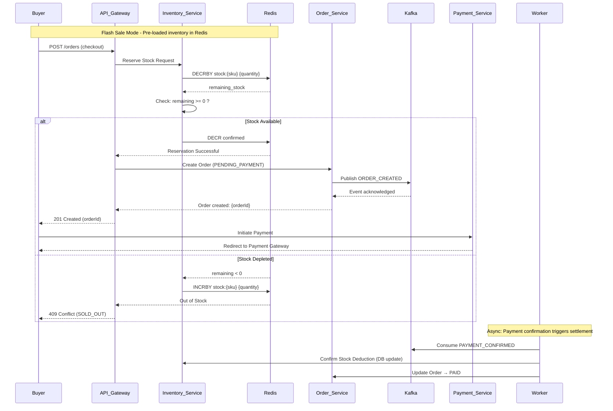
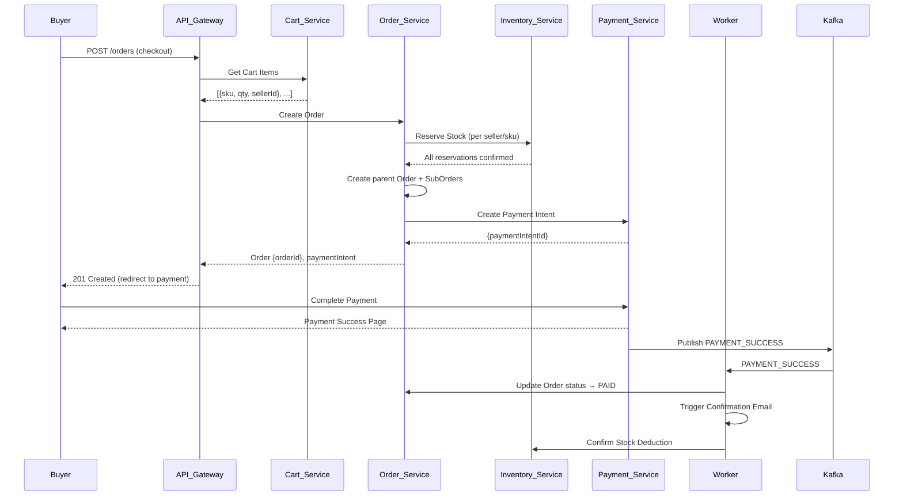
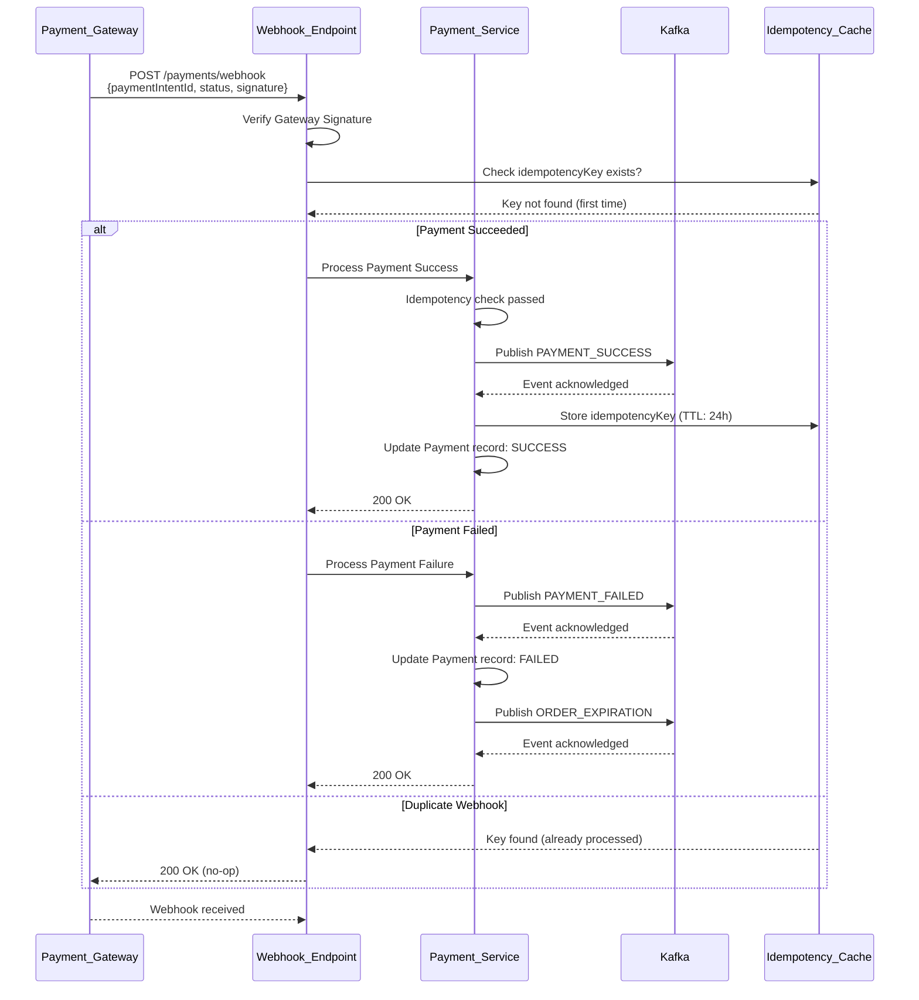
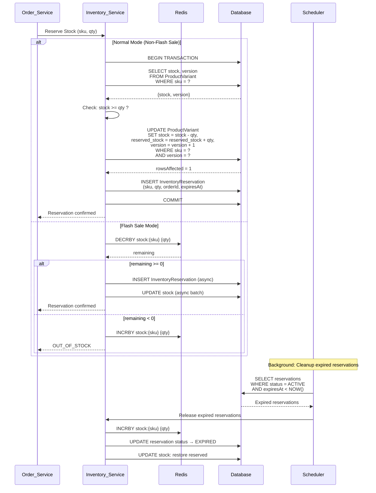
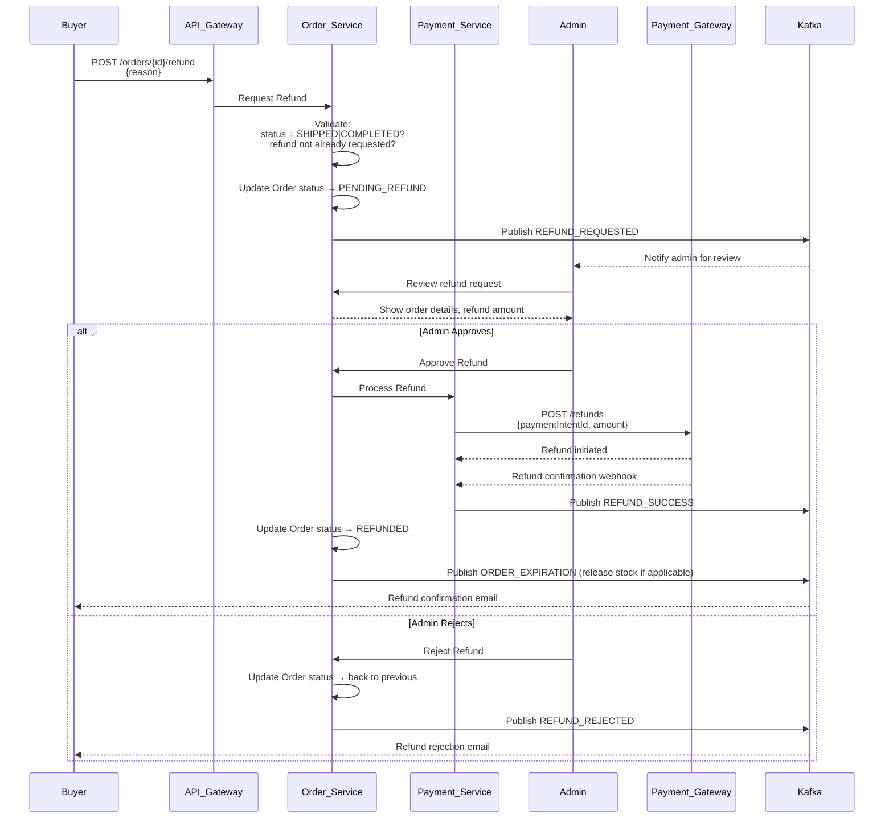
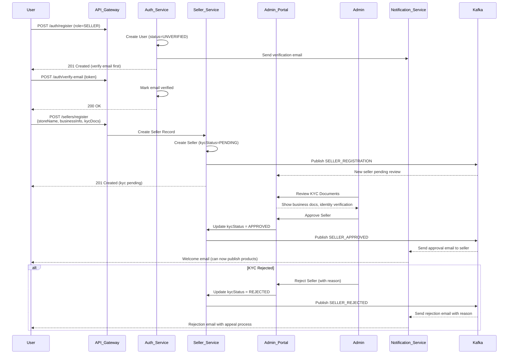

# Sequence Diagrams

**Version:** 1.0.0 | **Date:** 2026-04-07

> **Related Documents:**
>
> - [SYSTEM_ARCHITECTURE.md](./SYSTEM_ARCHITECTURE.md) — Architecture overview this diagrams are part of
> - [GLOSSARY.md](./../01-requirements/GLOSSARY.md) — Term definitions

---

## Table of Contents

1. [Flash Sale Checkout Flow](#1-flash-sale-checkout-flow)
2. [Normal Order Flow](#2-normal-order-flow)
3. [Payment Webhook Flow](#3-payment-webhook-flow)
4. [Inventory Reservation Flow](#4-inventory-reservation-flow)
5. [Refund Flow](#5-refund-flow)
6. [Seller Onboarding Flow](#6-seller-onboarding-flow)

---

## 1. Flash Sale Checkout Flow

### Mermaid Diagram

### Step-by-Step Explanation

**Step 1: Stock Reservation (Atomic)**

- Before the flash sale, inventory is pre-loaded into Redis as atomic counters
- On checkout, Inventory_Service calls `DECRBY` (atomic decrement) on Redis
- If remaining stock >= 0: reservation is successful
- If remaining stock < 0: immediately call `INCRBY` to restore and return SOLD_OUT

**Step 2: Order Creation**

- Once stock is reserved, Order_Service creates a parent order and sub-orders
- Publishes `ORDER_CREATED` event to Kafka
- Returns order ID to buyer immediately

**Step 3: Payment**

- Buyer is redirected to payment gateway
- Payment gateway processes payment

**Step 4: Async Settlement**

- Worker consumes `PAYMENT_CONFIRMED` from Kafka
- Confirms stock deduction in the database (async)
- Updates order status to PAID
- Triggers email notification

---

## 2. Normal Order Flow

### Mermaid Diagram

### Step-by-Step Explanation

**Step 1: Cart Validation**

- Fetch all cart items for the authenticated buyer
- Validate each item: product exists, seller is approved, stock is available

**Step 2: Inventory Reservation**

- For each seller, reserve the required stock
- Use optimistic locking (version field) for DB updates
- If any reservation fails, rollback all and return error

**Step 3: Order Creation**

- Create parent Order with status `PENDING_PAYMENT`
- Create SubOrder per seller with their respective items
- Calculate subtotal per seller (for commission calculation)

**Step 4: Payment Intent**

- Create payment intent with idempotency key (prevents duplicate charges)
- Return payment redirect URL to buyer

**Step 5: Payment Confirmation (Async)**

- Payment gateway calls webhook with payment result
- Worker processes PAYMENT_SUCCESS:
  - Updates order to `PAID`
  - Confirms inventory deduction
  - Sends confirmation email

---

## 3. Payment Webhook Flow

### Mermaid Diagram

### Step-by-Step Explanation

**Step 1: Signature Verification**

- Payment gateways sign webhook payloads with a secret key
- Always verify the signature before processing

**Step 2: Idempotency Check**

- Check Redis for the idempotency key associated with this payment
- If key exists: return 200 OK immediately (duplicate, no-op)
- If key does not exist: process the payment

**Step 3: Payment Success Path**

- Update Payment record to SUCCESS
- Publish PAYMENT_SUCCESS to Kafka
- Store idempotency key in Redis (TTL: 24 hours)

**Step 4: Payment Failure Path**

- Update Payment record to FAILED
- Publish PAYMENT_FAILED to Kafka (triggers inventory release)
- Trigger order expiration countdown

---

## 4. Inventory Reservation Flow

### Mermaid Diagram

### Step-by-Step Explanation

**Normal Mode (MVP):**

- Uses optimistic locking with a version field
- Read current stock and version in a transaction
- Attempt update only if version matches
- If rowsAffected = 0, retry (up to 3 times) or fail
- Insert reservation record with expiration timestamp

**Flash Sale Mode:**

- Redis DECRBY is atomic — no race conditions
- If counter goes negative, immediately restore and reject
- Database updates are batched asynchronously

**Expired Reservation Cleanup:**

- Scheduled job runs every minute
- Finds all ACTIVE reservations past their expiration time
- Releases reserved stock back to available pool
- Updates reservation status to EXPIRED

---

## 5. Refund Flow

### Mermaid Diagram

### Step-by-Step Explanation

**Step 1: Buyer Requests Refund**

- Buyer submits refund request with reason
- Order status transitions to `PENDING_REFUND`
- Admin is notified via Kafka queue

**Step 2: Admin Review**

- Admin reviews the request: checks order details, buyer history, refund reason
- Can approve or reject

**Step 3: Refund Processing**

- On approval, Payment_Service calls the payment gateway's refund API
- Payment gateway processes the refund and sends webhook confirmation
- Order status updated to `REFUNDED`
- Inventory is released back to available stock (if applicable)

---

## 6. Seller Onboarding Flow

### Mermaid Diagram

### Step-by-Step Explanation

**Step 1: Registration**

- User registers with role = SELLER
- User record created with UNVERIFIED status
- Verification email sent immediately

**Step 2: Email Verification**

- User clicks verification link
- User status updated to VERIFIED
- User can now proceed to seller registration

**Step 3: Seller Registration**

- User submits KYC documents (business registration, identity proof, bank account)
- Seller record created with `kycStatus = PENDING`
- Admin is notified of new seller application

**Step 4: KYC Review**

- Admin reviews submitted documents
- May approve, reject, or request additional documents

**Step 5: Approval**

- On approval, seller status = APPROVED
- Seller receives welcome email
- Seller can now create and publish products

---

_All sequence diagrams follow [SYSTEM_ARCHITECTURE.md](./SYSTEM_ARCHITECTURE.md) architectural decisions._
